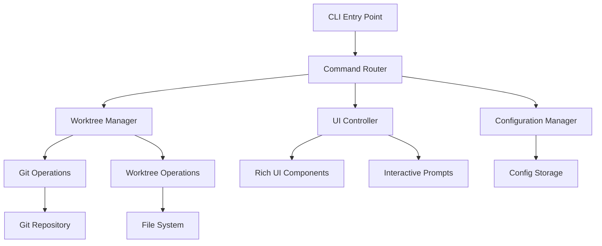

# Design Document

## Overview

The Git Worktree Manager is a Python-based CLI tool that provides an interactive interface for managing Git worktrees using the Rich library. The tool follows a modular architecture with clear separation between Git operations, user interface components, configuration management, and core business logic.

The application operates as a single-command CLI tool that detects the current Git repository context and provides different operational modes: interactive worktree creation, worktree listing/status viewing, and configuration management.

## Architecture

### High-Level Architecture



### Core Components

1. **CLI Entry Point**: Main command-line interface using Click or argparse
2. **Command Router**: Routes user commands to appropriate handlers
3. **Worktree Manager**: Core business logic for worktree operations
4. **Git Operations**: Low-level Git command interface
5. **UI Controller**: Rich-based user interface management
6. **Configuration Manager**: Handles user preferences and settings

## Components and Interfaces

### 1. CLI Entry Point (`cli.py`)

```python
class GitWorktreeCLI:
    def main(args: List[str]) -> int
    def create_worktree() -> None
    def list_worktrees() -> None
    def configure() -> None
```

**Responsibilities:**
- Parse command-line arguments
- Validate Git repository context
- Route to appropriate command handlers
- Handle top-level error cases

### 2. Worktree Manager (`worktree_manager.py`)

```python
class WorktreeManager:
    def create_worktree(name: str, base_branch: str, location: str) -> WorktreeInfo
    def list_worktrees() -> List[WorktreeInfo]
    def get_worktree_status(worktree: WorktreeInfo) -> WorktreeStatus
    def calculate_diff_summary(worktree: WorktreeInfo) -> DiffSummary
```

**Responsibilities:**
- Orchestrate worktree creation workflow
- Aggregate worktree information
- Calculate performance-optimized diff summaries
- Manage worktree lifecycle operations

### 3. Git Operations (`git_ops.py`)

```python
class GitOperations:
    def get_branches() -> List[str]
    def get_current_branch() -> str
    def create_worktree(path: str, branch: str, base_branch: str) -> None
    def list_worktrees() -> List[Dict]
    def get_commit_info(branch: str) -> CommitInfo
    def get_diff_summary(branch1: str, branch2: str) -> DiffSummary
    def is_git_repository() -> bool
```

**Responsibilities:**
- Execute Git commands safely
- Parse Git command output
- Handle Git-specific error conditions
- Optimize Git operations for performance

### 4. UI Controller (`ui_controller.py`)

```python
class UIController:
    def prompt_branch_name() -> str
    def select_base_branch(branches: List[str]) -> str
    def select_worktree_location() -> str
    def display_worktree_list(worktrees: List[WorktreeInfo]) -> None
    def display_worktree_details(worktree: WorktreeInfo) -> None
    def show_progress(message: str) -> None
```

**Responsibilities:**
- Render Rich-based user interfaces
- Handle interactive user input
- Display formatted information tables
- Manage progress indicators

### 5. Configuration Manager (`config.py`)

```python
class ConfigManager:
    def get_default_worktree_location() -> str
    def set_default_worktree_location(path: str) -> None
    def load_user_preferences() -> Dict
    def save_user_preferences(prefs: Dict) -> None
```

**Responsibilities:**
- Manage user configuration persistence
- Handle environment variable integration
- Provide configuration defaults
- Validate configuration values

## Data Models

### WorktreeInfo
```python
@dataclass
class WorktreeInfo:
    path: str
    branch: str
    commit_hash: str
    commit_message: str
    base_branch: Optional[str]
    is_bare: bool
    has_uncommitted_changes: bool
```

### DiffSummary
```python
@dataclass
class DiffSummary:
    files_modified: int
    files_added: int
    files_deleted: int
    total_insertions: int
    total_deletions: int
    summary_text: str
```

### CommitInfo
```python
@dataclass
class CommitInfo:
    hash: str
    message: str
    author: str
    date: datetime
    short_hash: str
```

## Error Handling

### Error Categories

1. **Git Repository Errors**
   - Not in a Git repository
   - Git command failures
   - Repository corruption

2. **File System Errors**
   - Permission denied
   - Disk space issues
   - Invalid paths

3. **User Input Errors**
   - Invalid branch names
   - Conflicting worktree names
   - Invalid configuration values

### Error Handling Strategy

```python
class WorktreeError(Exception):
    """Base exception for worktree operations"""
    pass

class GitRepositoryError(WorktreeError):
    """Git repository related errors"""
    pass

class FileSystemError(WorktreeError):
    """File system related errors"""
    pass

class UserInputError(WorktreeError):
    """User input validation errors"""
    pass
```

**Error Handling Principles:**
- Fail fast with clear error messages
- Provide actionable suggestions for resolution
- Clean up partial operations on failure
- Log errors for debugging while showing user-friendly messages

## Testing Strategy

### Unit Testing
- **Git Operations**: Mock Git commands, test parsing logic
- **Worktree Manager**: Test business logic with mocked dependencies
- **UI Controller**: Test Rich component rendering and user input handling
- **Configuration Manager**: Test configuration persistence and validation

### Integration Testing
- **End-to-End Workflows**: Test complete worktree creation and listing flows
- **Git Integration**: Test with real Git repositories in isolated environments
- **File System Integration**: Test worktree creation and cleanup

### Performance Testing
- **Large Repository Testing**: Test with repositories containing 50+ worktrees
- **Diff Calculation Performance**: Benchmark diff summary generation
- **UI Responsiveness**: Ensure UI remains responsive during operations

### Test Structure
```
tests/
├── unit/
│   ├── test_git_ops.py
│   ├── test_worktree_manager.py
│   ├── test_ui_controller.py
│   └── test_config.py
├── integration/
│   ├── test_workflows.py
│   └── test_git_integration.py
└── performance/
    └── test_performance.py
```

## Performance Optimizations

### Git Command Optimization
- Use `git worktree list --porcelain` for structured output parsing
- Batch Git operations where possible
- Cache branch lists and commit information
- Use `git log --oneline -1` for efficient commit info retrieval

### UI Performance
- Implement lazy loading for large worktree lists
- Use Rich's live display for progress indicators
- Minimize expensive operations during interactive prompts

### Memory Management
- Stream large Git command outputs
- Limit cached data size
- Clean up temporary resources promptly

## Security Considerations

### Input Validation
- Sanitize branch names and file paths
- Validate Git repository integrity
- Prevent path traversal attacks in worktree locations

### Command Injection Prevention
- Use subprocess with argument lists instead of shell commands
- Validate all user inputs before passing to Git commands
- Escape special characters in file paths

## Configuration and Environment

### Environment Variables
- `WORKTREE_DEFAULT_PATH`: Default location for worktree storage
- `WORKTREE_CONFIG_PATH`: Custom configuration file location

### Configuration File Format (TOML)
```toml
[worktree]
default_path = "~/worktrees"
auto_cleanup = true

[ui]
theme = "dark"
show_progress = true

[performance]
cache_timeout = 300
max_cached_items = 100
```

## Dependencies

### Core Dependencies
- **Rich**: UI components and formatting
- **Click**: Command-line interface framework
- **GitPython** (optional): Alternative to subprocess for Git operations
- **TOML**: Configuration file parsing
- **UV**: Package Management

### Development Dependencies
- **pytest**: Testing framework
- **pytest-mock**: Mocking for tests
- **black**: Code formatting
- **mypy**: Type checking